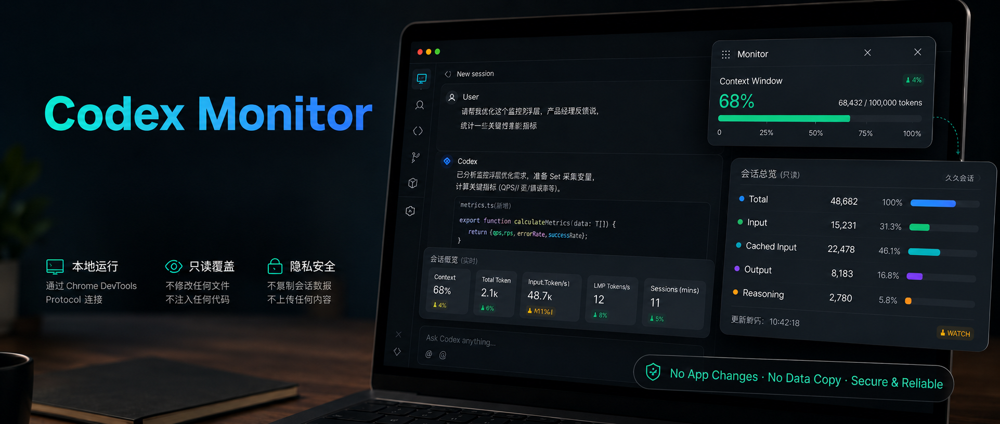

# Codex Monitor



English | [中文](README.zh-CN.md)

Codex Monitor is a local, read-only overlay for Codex Desktop. It shows context-window usage and token consumption inside the existing Codex window without patching the app bundle or copying session data into this repository.


## Author

Built by Kevin KE.

- GitHub: [KevinKE93](https://github.com/KevinKE93)

## Features

- Draggable `Monitor` panel inside Codex Desktop.
- Collapsed Monitor title shows the current session total token value, for example `Monitor (ttk:58.9M)`.
- Per-response chip in the format `Token: Current ... | Total ...   Rounds: User ... | Assistant ...`.
- Sidebar hover panel with session-level total, input, cached input, output, and reasoning tokens.
- Token display unit switcher: raw, K, and M. The default unit is K.
- Collapsed Monitor keeps the compact title and expand button while hiding unit controls.
- Local-only operation through Chrome DevTools Protocol.

## Install

Copy this GitHub URL:

```text
https://github.com/KevinKE93/Codex-Monitor
```

In Codex Desktop, open the plugin or marketplace install entry and paste the URL. If you prefer the CLI, run:

```bash
codex plugin marketplace add https://github.com/KevinKE93/Codex-Monitor --ref main
codex plugin add codex-monitor@codex-monitor
```

After installation, ask Codex:

```text
Start Codex Monitor.
```

The plugin install makes the `codex-monitor` skill available. The visible overlay still needs the local injector to run. For automatic startup after login, Codex restart, or Codex update, run this from the installed plugin root:

```bash
./scripts/install_launch_agent.sh 9222
```

## Usage

Run the monitor with automatic re-injection:

```bash
./scripts/start_codex_monitor.sh 9222
```

This is the recommended path. It opens Codex with a local DevTools port and keeps the injector running so the overlay is restored after a Codex renderer restart.
The injector refreshes the session payload every 10 seconds by default while the in-page observer handles ordinary UI changes.
For responsiveness, sidebar hover summaries cover the latest 100 sessions while per-message chip details are parsed for the latest 12 sessions by default. Use `--detail-limit` on `context_token_injector.py` if you need chips for older sessions.
If the requested port is occupied, the scripts automatically move to the next available local port.

Install the macOS LaunchAgent for automatic start after login, Codex restart, or Codex update:

```bash
./scripts/install_launch_agent.sh 9222
```

Stop automatic start:

```bash
./scripts/uninstall_launch_agent.sh
```

Launch Codex with a local DevTools port:

```bash
./scripts/reopen_codex_with_debug.sh 9222
```

Inject the monitor into the current Codex window:

```bash
./run_once.sh 9222
```

Run it again after restarting Codex. The injected UI keeps itself updated while the current page is active.

## Codex Desktop Updates

Codex Monitor injects temporary DOM elements into the active Codex renderer. That is deliberate: it avoids changing `Codex.app` or app resources. If Codex Desktop upgrades, restarts, or replaces the renderer, the injected UI disappears and must be injected again.

Use `./scripts/start_codex_monitor.sh 9222` for the automated path. It relaunches Codex with the DevTools port, runs the injector in a loop, and reopens/reinjects when the DevTools endpoint disappears. Use `./scripts/install_launch_agent.sh 9222` to keep this loop alive after login, Codex restart, and Codex updates. If a future Codex release changes the DOM anchors for sidebar rows or assistant messages, the monitor will still read token data, but chip placement may need a selector update.

## Codex Plugin

This repository is also packaged as a Codex plugin:

- Manifest: `.codex-plugin/plugin.json`
- Skill: `skills/codex-monitor/SKILL.md`
- Marketplace manifest for GitHub install: `.agents/plugins/marketplace.json`

The plugin exposes the local scripts and usage workflow. Current Codex plugins do not provide a supported native render hook for the desktop sidebar or message DOM, so the visible overlay is still opt-in through the local DevTools injector.

## CLI Inspection

```bash
python3 ./scripts/context_token_inspector.py --latest --format footer
python3 ./scripts/context_token_inspector.py --latest --format hover
python3 ./scripts/context_token_inspector.py --limit 20 --format table
```

## Metric Glossary

| Term | Meaning | Source or Formula |
| --- | --- | --- |
| `context` | Current request context usage. | `last_token_usage.input_tokens` |
| `context window` | Model context window reported by Codex token-count events. | `model_context_window` |
| `left` | Estimated remaining context in the current request. | `context window - context` |
| `Token: Current` | Current request context usage against the model context window. | `last_token_usage.input_tokens / model_context_window` |
| `Token: Total` | Current assistant response token usage against cumulative current-session token usage. | `last_token_usage.total_tokens / total_token_usage.total_tokens` |
| `session` | Current session total shown in the Monitor panel. It is not a sum across all conversations. | latest session JSONL |
| `in` | Input tokens recorded by Codex. In the Monitor session line, this is cumulative session input. | `input_tokens` |
| `cached` | Cached input tokens recorded by Codex. This can be high when repeated context is reused. | `cached_input_tokens` |
| `out` | Output tokens produced by the assistant. | `output_tokens` |
| `reason` | Reasoning output tokens recorded by Codex. | `reasoning_output_tokens` |
| `user rounds` | Number of non-environment user messages in the current session. This is the human-facing conversation round count. | parsed user messages |
| `assistant rounds` | Number of assistant messages in the current session that have token-count records. One user round may contain multiple assistant rounds because Codex can emit progress/status messages before the final answer. | parsed assistant messages with token usage |
| `status` | Context pressure indicator. `OK` is below 70%, `WATCH` is 70% or above, and `HIGH` is 85% or above. | `context / context window` |
| `raw / K / M` | Display unit for token values. `raw` shows the original integer, `K` shows thousands, and `M` shows millions. The default is `K`. | UI setting |

## Safety Boundary

Codex Monitor does not modify:

- `Codex.app`
- `app.asar`
- Codex session JSONL files
- Codex settings or authentication

It reads local Codex session logs and injects temporary DOM elements into a Codex renderer launched with a local DevTools port.

## Tests

```bash
PYTHONDONTWRITEBYTECODE=1 python3 ./tests/test_context_token_inspector.py
```

## Repository Privacy

This repository contains only source code, tests, and a synthetic demo image. It does not include local Codex session data, generated logs, marketplace metadata, screenshots of private conversations, or conversation transcripts.

## License

MIT. See [LICENSE](LICENSE).
