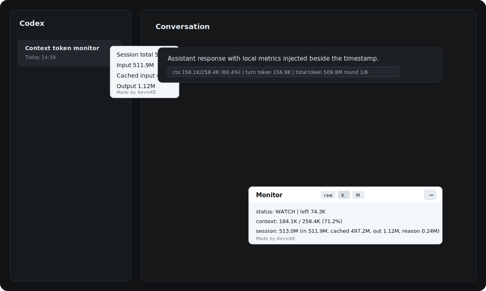

# Codex Monitor

Codex Monitor is a local, read-only overlay for Codex Desktop. It shows context-window usage and token consumption inside the existing Codex window without patching the app bundle or copying session data into this repository.

Codex Monitor 是一个本地只读的 Codex Desktop 监控浮层。它可以在现有 Codex 窗口中显示 context window 使用情况和 token 消耗，不修改客户端安装包，也不会把本地会话数据复制进仓库。



## Author / 作者

Built by Kevin KE.

由 Kevin KE 制作。

- GitHub: [KevinKE93](https://github.com/KevinKE93)

## Features / 主要功能

- Draggable `Monitor` panel inside Codex Desktop.
- 在 Codex Desktop 内显示可拖动的 `Monitor` 面板。
- Per-response chip with context usage, turn token, cumulative session token, current-session user rounds, and assistant rounds.
- 在每条回复后显示 chip：包含 context 使用量、本轮 token、当前 session 累计 token、user rounds 和 assistant rounds。
- Sidebar hover panel with session-level total, input, cached input, output, and reasoning tokens.
- 左侧会话列表 hover 面板显示当前 session 的 total、input、cached input、output 和 reasoning token。
- Token display unit switcher: raw, K, and M. The default unit is K.
- token 单位支持 raw、K、M，默认使用 K。
- Collapsed Monitor keeps the compact title and expand button while hiding unit controls.
- Monitor 收起后只保留紧凑标题和展开按钮，隐藏单位切换控件。
- Local-only operation through Chrome DevTools Protocol.
- 通过 Chrome DevTools Protocol 本地运行，不依赖远端服务。

## Metric Glossary / 显示名词解释

`context`

Current request context usage. It uses the latest `last_token_usage.input_tokens` divided by `model_context_window`.

当前请求占用的上下文量。计算口径是最新一次 `last_token_usage.input_tokens` 除以 `model_context_window`。

`context window`

The model context window reported by Codex token-count events.

Codex token-count 事件里记录的模型上下文窗口上限。

`left`

Estimated remaining context in the current request: `context window - context`.

当前请求预计剩余 context：`context window - context`。

`turn token`

Token usage for the current assistant response, from `last_token_usage.total_tokens`.

当前 assistant 回复这一轮的 token 消耗，来自 `last_token_usage.total_tokens`。

`total token`

Cumulative token usage for the current session, from `total_token_usage.total_tokens`.

当前 session 的累计 token 消耗，来自 `total_token_usage.total_tokens`。

`session`

The current session total shown in the Monitor panel. It is not a sum across all conversations.

Monitor 面板中的当前 session 总消耗，不统计其他会话。

`in`

Input tokens recorded by Codex. In the Monitor session line, this is cumulative session input.

Codex 记录的输入 token。在 Monitor 的 session 行里，它表示当前 session 累计输入。

`cached`

Cached input tokens recorded by Codex. This can be high when repeated context is reused.

Codex 记录的 cached input token。当重复上下文被复用时，这个值可能较高。

`out`

Output tokens produced by the assistant.

assistant 生成的输出 token。

`reason`

Reasoning output tokens recorded by Codex.

Codex 记录的 reasoning output token。

`user rounds`

Number of non-environment user messages in the current session. This is the human-facing conversation round count.

当前 session 中非环境消息的 user message 数量。这个更接近人理解的“对话轮次”。

`assistant rounds`

Number of assistant messages in the current session that have token-count records. One user round may contain multiple assistant rounds because Codex can emit progress/status messages before the final answer.

当前 session 中带 token-count 记录的 assistant message 数量。一次 user round 里可能出现多个 assistant rounds，因为 Codex 可能先输出进度/状态消息，再输出最终回复。

`status`

Context pressure indicator. `OK` is below 70%, `WATCH` is 70% or above, and `HIGH` is 85% or above.

context 压力提示。低于 70% 为 `OK`，达到 70% 为 `WATCH`，达到 85% 为 `HIGH`。

`raw / K / M`

Display unit for token values. `raw` shows the original integer, `K` shows thousands, and `M` shows millions. The default is `K`.

token 显示单位。`raw` 显示原始整数，`K` 显示千，`M` 显示百万。默认单位是 `K`。

## Safety Boundary / 安全边界

Codex Monitor does not modify:

Codex Monitor 不会修改：

- `Codex.app`
- `app.asar`
- Codex session JSONL files / Codex 会话 JSONL 文件
- Codex settings or authentication / Codex 设置或登录认证信息

It reads local Codex session logs and injects temporary DOM elements into a Codex renderer launched with a local DevTools port.

它只读取本地 Codex session 日志，并向带本地 DevTools 端口启动的 Codex renderer 注入临时 DOM 元素。

## Usage / 使用方式

Run the monitor with automatic re-injection:

推荐使用自动重注入模式：

```bash
./scripts/start_codex_monitor.sh 9222
```

This is the recommended path. It opens Codex with a local DevTools port and keeps the injector running so the overlay is restored after a Codex renderer restart.

这是推荐方式。脚本会用本地 DevTools 端口打开 Codex，并持续运行 injector；当 Codex renderer 重启后，浮层会自动恢复。

Launch Codex with a local DevTools port:

手动用本地 DevTools 端口启动 Codex：

```bash
./scripts/reopen_codex_with_debug.sh 9222
```

Inject the monitor into the current Codex window:

向当前 Codex 窗口注入 Monitor：

```bash
./run_once.sh 9222
```

Run it again after restarting Codex. The injected UI keeps itself updated while the current page is active.

Codex 重启后需要重新运行。当前页面保持打开时，已注入的 UI 会持续更新。

## Codex Desktop Updates / Codex 客户端升级处理

Codex Monitor injects temporary DOM elements into the active Codex renderer. That is deliberate: it avoids changing `Codex.app` or app resources. If Codex Desktop upgrades, restarts, or replaces the renderer, the injected UI disappears and must be injected again.

Codex Monitor 注入的是临时 DOM 元素，这是有意设计的：它避免修改 `Codex.app` 或客户端资源。如果 Codex Desktop 升级、重启或替换 renderer，已注入的 UI 会消失，需要重新注入。

Use `./scripts/start_codex_monitor.sh 9222` for the automated path. It relaunches Codex with the DevTools port, runs the injector in a loop, and reopens/reinjects when the DevTools endpoint disappears. If a future Codex release changes the DOM anchors for sidebar rows or assistant messages, the monitor will still read token data, but chip placement may need a selector update.

自动化方式请使用 `./scripts/start_codex_monitor.sh 9222`。它会用 DevTools 端口重新启动 Codex，并循环运行 injector；当 DevTools endpoint 消失时，会重新打开并注入。如果未来 Codex 改动了侧边栏行或 assistant 消息的 DOM anchor，Monitor 仍然能读取 token 数据，但 chip 挂载位置可能需要更新 selector。

## Codex Plugin / Codex 插件

This repository is also packaged as a Codex plugin:

这个仓库也已经封装成 Codex plugin：

- Manifest / 插件清单: `.codex-plugin/plugin.json`
- Skill / 插件技能: `skills/codex-monitor/SKILL.md`

The plugin exposes the local scripts and usage workflow. Current Codex plugins do not provide a supported native render hook for the desktop sidebar or message DOM, so the visible overlay is still opt-in through the local DevTools injector.

插件暴露了本地脚本和使用流程。当前 Codex plugin 还没有提供受支持的原生 sidebar 或消息 DOM render hook，因此可视化浮层仍然通过本地 DevTools injector 按需启用。

## CLI Inspection / 命令行查看

```bash
python3 ./scripts/context_token_inspector.py --latest --format footer
python3 ./scripts/context_token_inspector.py --latest --format hover
python3 ./scripts/context_token_inspector.py --limit 20 --format table
```

## Tests / 测试

```bash
PYTHONDONTWRITEBYTECODE=1 python3 ./tests/test_context_token_inspector.py
```

## Repository Privacy / 仓库隐私

This repository contains only source code, tests, and a synthetic demo image. It does not include local Codex session data, generated logs, marketplace metadata, screenshots of private conversations, or conversation transcripts.

本仓库只包含源码、测试和合成示意图，不包含本地 Codex session 数据、生成日志、marketplace 元数据、私人对话截图或对话记录。

## License / 开源许可

MIT. See [LICENSE](LICENSE).

MIT 许可证。详见 [LICENSE](LICENSE)。
